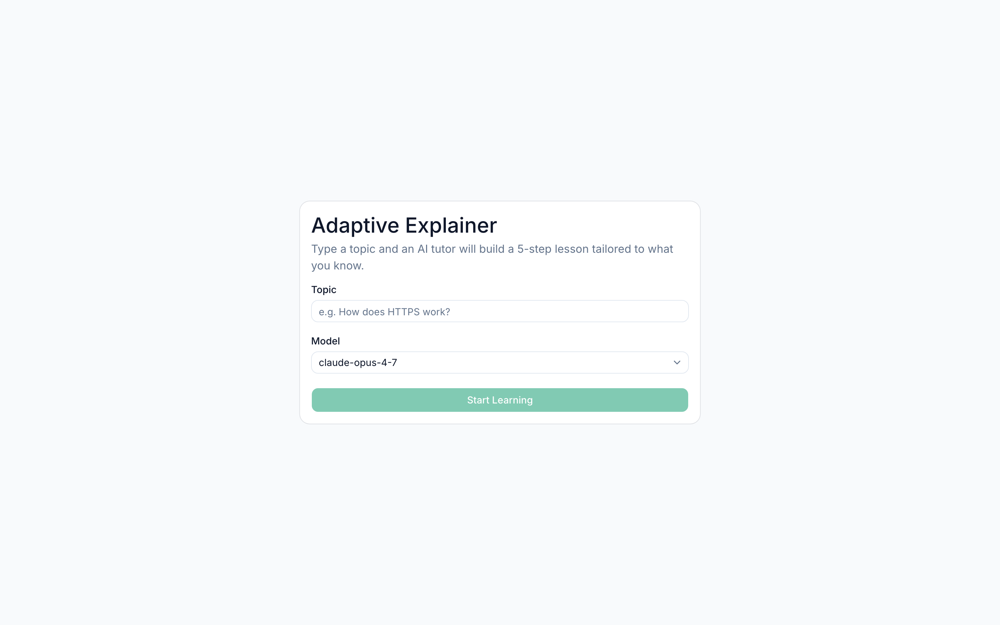
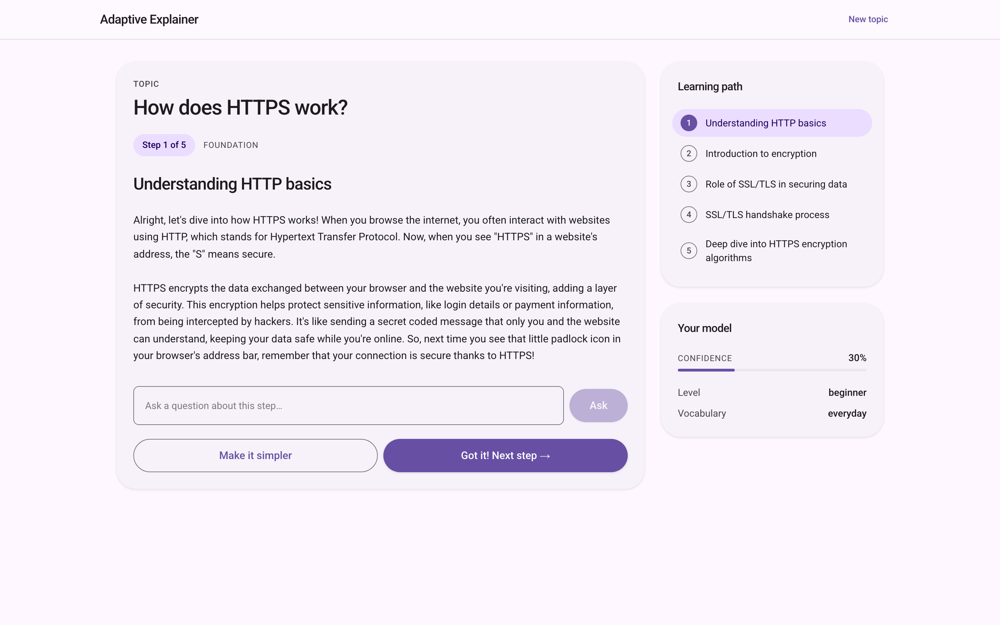
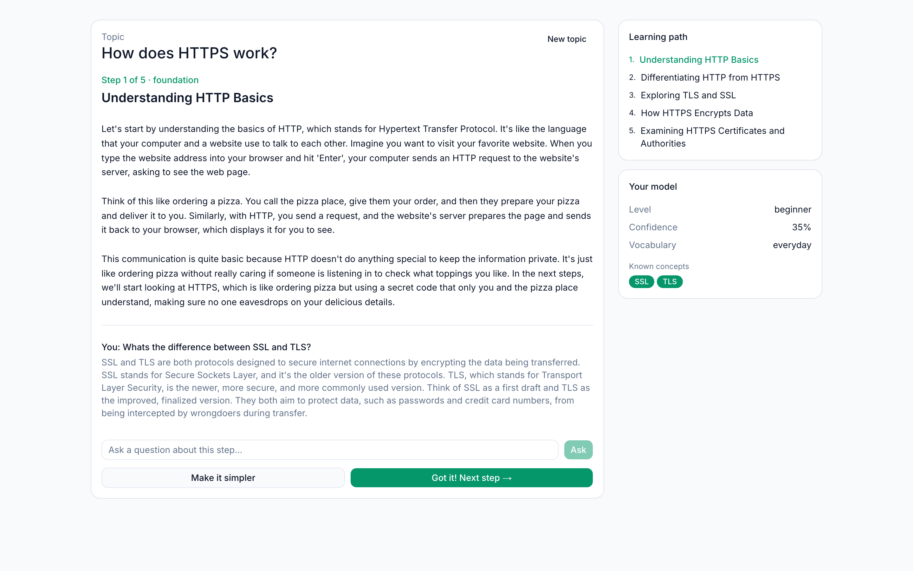

# Adaptive Explainer

An AI-powered learning application that creates personalized, multi-step explanations for any topic. It builds a structured learning path, maintains a dynamic model of the learner's knowledge, adapts explanations in real time, and lets users ask follow-up questions at any point during a lesson.

**▶ Live demo: [adaptive-explainer.vercel.app](https://adaptive-explainer.vercel.app)**







## Features

- **Personalized learning paths** — the AI generates a 5-step curriculum (foundation → core → intermediate → advanced) tailored to any topic you enter
- **Adaptive user knowledge model** — the system maintains a live model of your inferred level, confidence score, known concepts, knowledge gaps, and vocabulary preference, updating it after every interaction
- **Follow-up questions** — ask anything mid-lesson; the AI answers in context and updates its model of what you know based on what your question reveals
- **"Make it simpler"** — request a simpler re-explanation at any time, which automatically lowers the inferred level and switches to everyday analogies
- **Streaming explanations** — explanation text renders token-by-token as the model produces it
- **Session persistence** — the lesson survives page refreshes via localStorage
- **Multi-model support** — switch between Claude (Opus 4.8, Sonnet 5, Haiku 4.5) and OpenAI (GPT-4o, GPT-4o mini) models on the fly
- **Rate limiting** — per-IP sliding-window limits (50 lessons and 400 LLM requests per 24h) to protect API usage in shared deployments

## How It Works

1. **Topic entry** — The user types any topic (e.g., "How does HTTPS work?") and selects an AI model.
2. **Learning path generation** — The `/api/start` endpoint sends a structured prompt to the chosen model, which returns a 5-step JSON curriculum with complexity levels and prerequisite chains.
3. **Step-by-step explanation** — The `/api/explain` endpoint streams an explanation for the current step, injecting the user's knowledge model and their recent questions into the prompt so the output matches their level and vocabulary preference.
4. **Question analysis** — When the user asks a question, the `/api/question` endpoint sends the question along with the current knowledge model to the AI. The AI returns both an answer and an updated knowledge model (level, confidence, known/gap concepts), which the frontend merges into the session state.
5. **Simplification** — Clicking "Make it simpler" triggers a specialized prompt that rewrites the current explanation using everyday analogies, shorter sentences, and no jargon.
6. **Progression** — Marking a step as understood advances the learner to the next step, increments the confidence score, and loads a new explanation adapted to their updated model.

## Architecture


```
src/
├── app/
│   ├── page.tsx              # Single-page React client (topic input + learning UI)
│   ├── layout.tsx            # Root layout with Roboto font and metadata
│   ├── globals.css           # Tailwind base styles
│   └── api/
│       ├── start/route.ts    # POST — generates a 5-step learning path (JSON)
│       ├── explain/route.ts  # POST — generates/simplifies an explanation for a step
│       ├── question/route.ts # POST — answers a question and updates the user model
│       └── status/route.ts   # GET  — returns available models and rate-limit info
└── lib/
    ├── types.ts              # TypeScript interfaces (LearningStep, UserKnowledgeModel, etc.)
    ├── llm.ts                # Unified LLM client (Anthropic + OpenAI), streaming, JSON parser
    ├── prompts.ts            # All prompt templates (learning path, explanation, question, simpler)
    ├── userModel.ts          # Knowledge-model merge logic (validated, clamped, deduplicated)
    ├── validate.ts           # Request validation: model allowlist + session size/shape checks
    └── rateLimit.ts          # In-memory per-IP sliding-window rate limiter
```


### Key Data Structures

| Type | Purpose |
|---|---|
| `LearningStep` | One step in the curriculum — id, title, complexity level, prerequisites, content, and completion status |
| `UserKnowledgeModel` | The system's live model of the learner — inferred level (`beginner`/`intermediate`/`advanced`), confidence (0–1), known concepts, gap concepts, vocabulary level, and reasoning |
| `LearningSession` | Full session state — topic, learning path, current step index, user model, and interaction history |

### API Endpoints

| Endpoint | Method | Description |
|---|---|---|
| `/api/status` | `GET` | Returns available models (Claude + OpenAI) and the caller's rate-limit status |
| `/api/start` | `POST` | Accepts `{ topic, model }`, generates a 5-step learning path via the LLM, initializes a default user model, and returns the full session object |
| `/api/explain` | `POST` | Accepts `{ session, model, simpler? }`, streams a level-adapted explanation for the current step as plain text (or a simplified re-explanation if `simpler` is true) |
| `/api/question` | `POST` | Accepts `{ session, question, model }`, returns `{ answer, updatedModel }` — the AI's answer plus a revised knowledge model reflecting what the question revealed |

### LLM Abstraction

The `llm.ts` module provides `queryModel(modelId, userPrompt, systemPrompt)` for complete responses and `streamModel(...)` for token-by-token streaming; both route to the Anthropic or OpenAI SDK based on the model ID prefix. Both clients are lazily initialized. A `parseJSON<T>()` helper extracts and parses JSON from free-text LLM responses. Every route validates the requested model against the `AVAILABLE_MODELS` allowlist and size-checks all client-supplied input before any LLM call.

### Prompt Engineering

All prompts live in `prompts.ts` and follow a consistent pattern: they inject the current `UserKnowledgeModel` into the prompt so the AI can tailor vocabulary, complexity, and analogies. Four prompt builders are used:

- `buildLearningPathPrompt` — generates the initial curriculum (returns JSON)
- `buildExplanationPrompt` — generates a step explanation, referencing known concepts and gaps
- `buildQuestionAnalysisPrompt` — analyzes a user question and returns both an answer and an updated knowledge model (JSON)
- `buildSimplerExplanationPrompt` — rewrites an explanation at a lower level

## Getting Started

### Prerequisites

- Node.js 18+
- An [Anthropic API key](https://console.anthropic.com/) and/or an [OpenAI API key](https://platform.openai.com/api-keys)

### Installation

1. Clone the repo:
   ```bash
   git clone https://github.com/jessholbrook/adaptive-explainer.git
   cd adaptive-explainer
   ```

2. Install dependencies:
   ```bash
   npm install
   ```

3. Create a `.env.local` file in the project root:
   ```
   ANTHROPIC_API_KEY=your_anthropic_api_key_here
   OPENAI_API_KEY=your_openai_api_key_here
   ```
   You only need one key — Claude models require `ANTHROPIC_API_KEY`, OpenAI models require `OPENAI_API_KEY`.

4. Start the development server:
   ```bash
   npm run dev
   ```

5. Open [http://localhost:3000](http://localhost:3000) in your browser.

### Tests

Unit tests (Vitest) cover the JSON parser, rate limiter, request validation, and knowledge-model merge logic:

```bash
npm test
```

## Usage

1. Enter any topic you want to learn about (e.g., "How does HTTPS work?", "What is machine learning?")
2. Select an AI model from the dropdown
3. Click **Start Learning** — the AI generates a 5-step learning path
4. Read the explanation, then either:
   - **Ask a question** — type in the question box and press Ask (the AI answers and updates your knowledge model)
   - **Make it Simpler** — get a re-explanation using everyday language
   - **Got it! Next Step** — mark the step complete and advance
5. Track your progress in the sidebar, which shows the learning path, your inferred level, confidence, known concepts, and knowledge gaps
6. When all steps are complete, start a new topic

## Tech Stack

- **[Next.js 14](https://nextjs.org/)** — App Router with React Server Components for API routes and a single client-side page
- **[TypeScript](https://www.typescriptlang.org/)** — end-to-end type safety across client, API routes, and LLM interfaces
- **[Tailwind CSS](https://tailwindcss.com/)** — utility-first styling, themed with a Material Design 3 (Material You) tonal color system
- **[Anthropic SDK](https://github.com/anthropics/anthropic-sdk-typescript)** — Claude model integration via `@anthropic-ai/sdk`
- **[OpenAI SDK](https://github.com/openai/openai-node)** — GPT model integration via `openai`

## Deployment

This project is configured for [Vercel](https://vercel.com/). Add your API keys as environment variables in the Vercel dashboard before deploying.


```bash
vercel --prod
```


> **Note:** The in-memory rate limiter resets on each deployment or serverless cold start. For persistent rate limiting in production, consider replacing `rateLimit.ts` with a Redis-backed solution.
